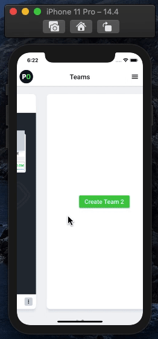
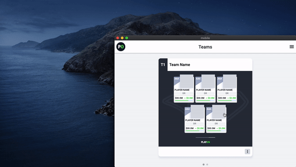
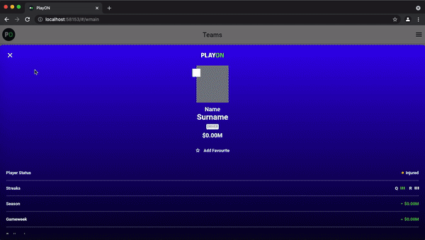
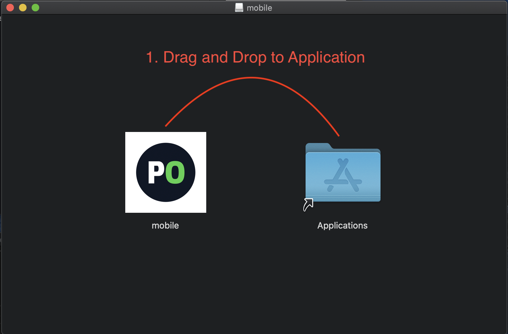
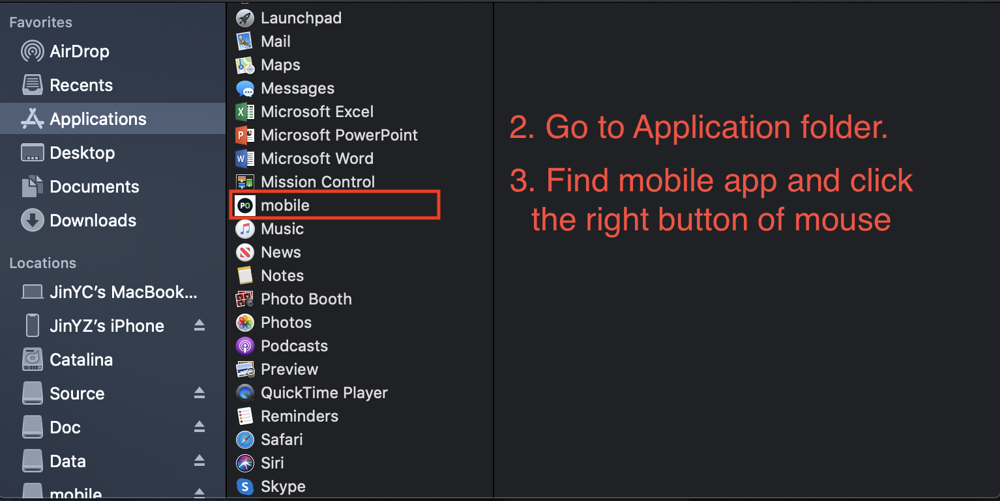
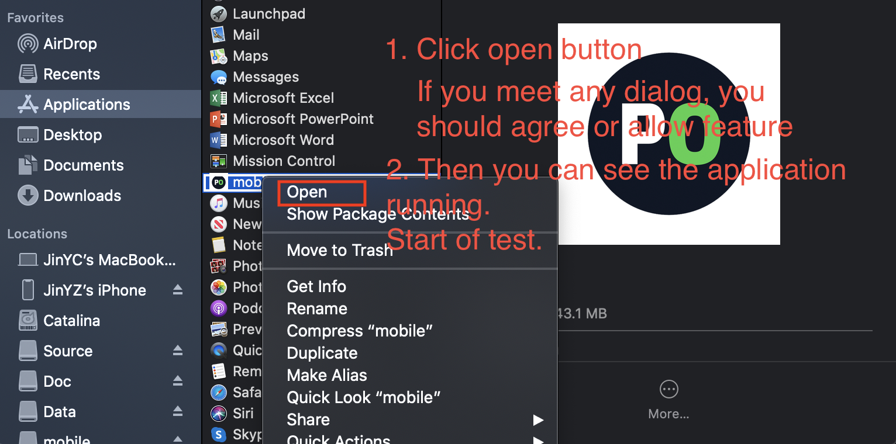

# PlayOnDemo

## Feature
1. Added main feature of PlayOn 
	Added own Team 
	Remove and Edit own Team 
	Read player list from URL 
2. Added main UI 
	Pageable 
	ScrollView and Listview 
	Filter and Bottomsheet 

## Preview
You can see the preview videos on assets folder. Pleaes download and check them.
1. Android Video : <a href="assets/preview_android.mp4">See Detail</a> 
	
2. iOS Video : <a href="assets/preview_ios.mov">See Detail</a> 
	
3. MacOS Video : <a href="assets/preview_macos.mov">See Detail</a> 
	
4. Web Video : <a href="assets/preview_web.mov">See Detail</a> 
	

## Demo Application
1. Android Version (*.apk) : <a href="assets/mobile.dmg">Download Here</a> 
2. MacOS Version (*.dmg) : <a href="assets/app-release.apk">Download Here</a> 
3. iOS Version: If you support your apple account or your udid, I will build that test version. 
	For now, you can check that through video.
4. Web Version: If you support your cpanel, I will build that test version.
	For now, you can check that through video.

## MacOS Version Install Guide
  

## Contact Us
1. Email : bgold1118@gmail.com
2. Skype ID: black.gold89@outlook.com
3. Whatsapp Number : +8562096227257